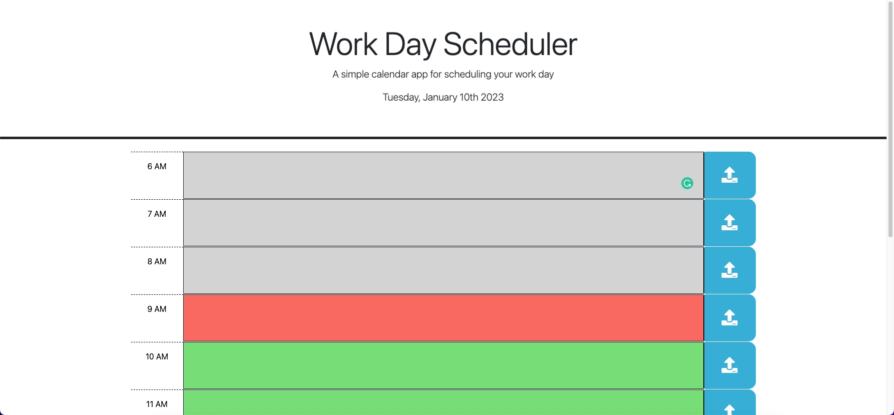

# Work Day Scheduler Challenge 6

## Description

This application displays the the current day of the month, and then displays the times 6 AM through 5 PM using moment.js. It then adds classes of past, present, and future to all time slots based on the current time. When the save button is clicked it saves the user's input to local storage. Once in local storage it will stay in the text area it had been added to even if the page is reloaded. 

## Screenshot

## Link

[URL](https://gdjewell.github.io/5-workdayscheduler/)

